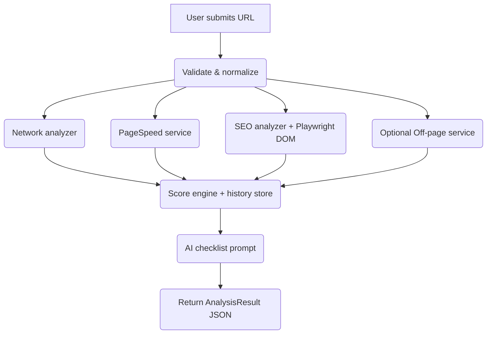

# Website Speed & SEO Performance Analyzer

A full-stack tool that audits any URL for performance, on-page SEO, accessibility, and off-page signals, then returns an AI-generated checklist so you know exactly what to fix. I built this to streamline agency-style audits: paste a URL, wait a few seconds, and hand the client a downloadable PDF plus a prioritized to-do list.

---

##  Highlights

- **Network checks** – reachability, HTTPS, redirect counts, HTTP status, response time, and surfaced server errors.
- **Core Web Vitals** – LCP, FCP, CLS, TBT via Google PageSpeed (mobile + desktop strategies).
- **On-page SEO** – title/meta/canonical quality, headings, viewport meta, indexability, robots directives, internal/external link counts, image alt coverage (even on SPAs thanks to Playwright DOM rendering).
- **Accessibility heuristics** – missing `lang`, skip links, landmarks, unlabeled form controls, and actionable fix lists inside each card.
- **Structured data & social tags** – JSON-LD counts/types, Open Graph, Twitter cards, plus contextual tooltips so teammates know why these fields matter.
- **Scan modes** – Fast mode skips heavy services for instant triage, Deep mode runs the full Playwright + off-page + AI stack.
- **Async queue + throttler** – background worker processes queued scans safely while per-instance throttling limits concurrent crawls.
- **AI optimization checklist** – OpenAI produces markdown checklists that become interactive to-do lists in the UI.
- **Downloadable report** – Playwright renders a polished PDF summarizing every card.
- **History sidebar** – jump back to any previous scan and compare scores.
- **Automated tests** – xUnit coverage for SEO parsing, scoring math, link health analyzer, and recommendation builder.

---

##  Architecture Overview

| Layer | Tools | Responsibilities |
| ----- | ----- | ---------------- |
| **Frontend** | React + Vite + TypeScript | URL input, loading states, chat-style analyzer status, report cards, AI checklist, collapsible history. |
| **Backend** | ASP.NET Core Minimal API (.NET 8) | Endpoint orchestration, network/SEO analyzers, link health checker, scoring engine, queue/throttler, history persistence, PDF rendering. |
| **Parsing/Rendering** | HtmlAgilityPack, Playwright | Parses static HTML, renders client-side DOMs, captures screenshots/PDF. |
| **External APIs** | Google PageSpeed, OpenAI Chat Completions, optional SEO providers | Supplies Core Web Vitals, generative checklist, and off-page metrics. |
| **Secrets** | `.env` + `LoadDotEnv()` | All API keys live outside source control; `appsettings*.json` contains placeholders only. |

### Backend flow (`POST /api/analyze`)



### Scoring

- **Performance score** uses weighted metrics:
  - LCP 35% · FCP 15% · TBT 20% · CLS 15% · Server response 15%
- **SEO score** weights:
  - Indexability (25%), metadata quality (20%), technical basics (15%), content structure (20%), accessibility (15%), social tags (5%)
- **Overall score** = 60% performance + 40% SEO, labeled as “Excellent”, “Needs work”, or “Critical.”

---

##  Frontend Experience

- **Splash / empty state** – explains Fast vs Deep scans and what data is captured.
- **Chat pane** – analyzer messages only (the “You” bubble is suppressed once a scan starts).
- **Score cards** – smooth view transitions with descriptive tooltips and red/green status chips.
- **Detail grid** – network, headings, accessibility, structured data & social, off-page, each with toggleable “Fix these” drawers.
- **AI Checklist** – every OpenAI bullet becomes a persistent checkbox so you can track progress live.
- **History panel** – collapsible desktop drawer + mobile overlay.
- **Download PDF** – fetches `/api/report/pdf` to hand clients a shareable artifact.

##  Scan Modes & Queue

- `ScanMode.Fast` (default) skips Playwright/off-page calls and checks only the essentials—perfect for quick triage or batching.
- `ScanMode.Deep` runs the full pipeline (Playwright DOM render, PageSpeed snapshots, off-page metrics, AI checklist, PDF).
- `/api/analyze/async` enqueues a scan for background processing. Poll `/api/analyze/async/{jobId}` to track status while the hosted worker respects concurrency limits via `AnalysisThrottler`.

Both sync and async paths share the same analyzers, so escalating a queued scan to Deep mode is just a payload change.

---

##  Secrets & Config

1. Copy `.env.example` → `.env` and fill in:
   ```env
   OPENAI_API_KEY=sk-...
   OPENAI_MODEL=gpt-4o-mini
   OPENAI_API_BASE_URL=https://api.openai.com/v1/chat/completions
   PERFORMANCE_API_KEY=AIza...
   PERFORMANCE_API_BASE_URL=https://www.googleapis.com/pagespeedonline/v5/runPagespeed
   PERFORMANCE_API_STRATEGY=mobile,desktop
   ```
2. Use `PERFORMANCE_API_STRATEGY` to decide which PageSpeed snapshots run: `mobile`, `desktop`, or a comma-separated list (default fetches both so the UI can compare them).
3. `.env` is gitignored; `LoadDotEnv()` walks up directories so the API finds it even when running from `SiteMonitor/SiteMonitor.Api/`.
4. `appsettings*.json` contains empty placeholders, keeping secrets out of commits.
5. Set `ALLOWED_ORIGINS` (comma-separated list) before deploying to Render so CORS accepts your Vercel domain (e.g., `https://your-app.vercel.app`). Use `http://localhost:5173` for local dev.
6. On Vercel, set `VITE_API_BASE_URL=https://<your-render-app>.onrender.com` so the frontend calls the hosted API. For local dev, set `VITE_API_BASE_URL=http://localhost:5218`.
7. Keep the Render backend warm to avoid multi-minute cold starts. Add a repository secret named `WARM_PING_URL` that points to your Render root status endpoint (e.g., `https://performance-seo-api.onrender.com/`). The scheduled GitHub Action in `.github/workflows/warm-backend.yml` pings it every 15 minutes so the dyno stays awake; you can also trigger it manually with *Run workflow*.

---

##  Getting Started

```bash
git clone https://github.com/mhanna50/Website_Speed_Analyzer.git
cd Website_Speed_Analyzer

# Backend (local)
cd SiteMonitor/SiteMonitor.Api
dotnet run

# Frontend (local)
cd ../frontend
cp .env.example .env # set VITE_API_BASE_URL if hitting a hosted backend
npm install
npm run dev
# Render / Docker build
cd SiteMonitor/SiteMonitor.Api
npx playwright install --with-deps chromium
dotnet publish SiteMonitor.Api.csproj -c Release
# Render / Docker build
cd SiteMonitor/SiteMonitor.Api
npx playwright install --with-deps chromium
dotnet publish SiteMonitor.Api.csproj -c Release
```

Open the frontend (e.g., http://localhost:5173), paste a URL, click “Analyze,” and watch the dashboard populate. The backend logs each external call so you can trace errors (e.g., PageSpeed quotas, OpenAI latency).

---

##  Development Notes

- **HTTPS redirection** is enabled; in dev you may see “Failed to determine the https port” warnings if the launch profile only specifies HTTP—harmless, but set `ASPNETCORE_HTTPS_PORT` to silence it.
- **Playwright** bundles platform-specific binaries; they stay out of Git thanks to `.gitignore`. Install headless deps on Render/Docker with `npx playwright install --with-deps chromium`.
- **HistoryStore** currently uses a simple JSON file for demo purposes; swap in Redis/DB for multi-user scenarios.
- **AI prompt** enforces that every checklist bullet references the site and includes actionable steps, cleaning up any leftover Markdown checkboxes before rendering in React.
- **Automated tests** cover scoring math, SEO parsing, recommendations, and link health; run them with `dotnet test`.
- **Production notes** – Playwright requires `npx playwright install --with-deps chromium` on Render/Docker; history writes to a local JSON file (ephemeral on Render), so move it to persistent storage or turn history off for multi-user hosting. Adjust `Analysis:MaxConcurrentScans` to keep Render dynos from overloading.
- **Cold-start UX** – the frontend pings the API root (with retries/backoff) on load and surfaces a “Waking the demo API…” banner or friendly error instead of Safari’s generic “Load failed.” Pair that with the keep-warm action to minimize impact from free-tier suspends.

---

##  Testing

```bash
cd SiteMonitor.Tests
dotnet test
```

The suite uses xUnit to validate:

- `SeoBuilder` (headings/accessibility parsing & SPA overrides)
- `ScoreCalculator` weighting and overall math
- `RecommendationBuilder` generation + AI checklist parsing

CI-ready output ensures future refactors keep the analyzer trustworthy.

---

##  Contributing / Roadmap

- Plug in additional performance providers (WebPageTest, Calibre, etc.)
- Add Lighthouse accessibility audits
- Multi-language AI prompts
- Scheduled scans + email summaries

PRs welcome—just keep secrets out of commits and follow the scoring structure. Happy auditing! 
- **Render deployment** – use the published output (`SiteMonitor.Api/bin/Release/net10.0/publish`) or set Render’s build command to `cd SiteMonitor/SiteMonitor.Api && npx playwright install --with-deps chromium && dotnet publish SiteMonitor.Api.csproj -c Release`.
